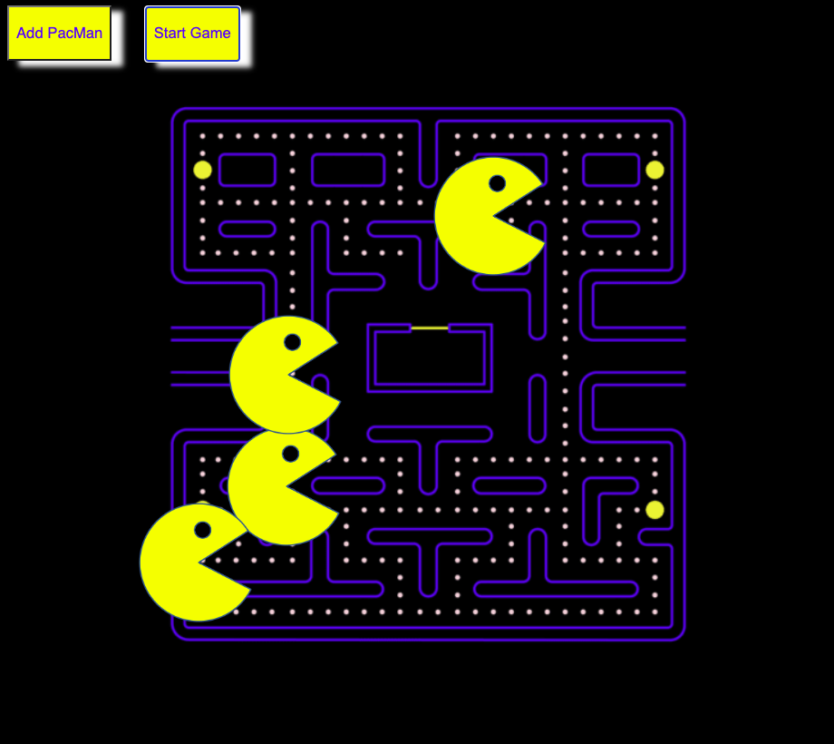

# PacMan Factory

 

# About:

 [Click here to see the PacMan Factory in action.](https://rainakpuels.github.io/PacMan-Factory)

This is an exercise developed during MIT xPro Full Stack Professional Certificate in Coding.

Using JavaScript and HTML, we created a "PacMan Factory" controlled by two buttons.

The "Add PacMan" button generates a PacMan in a random location using factory functions. You can click it as many times as you want.

The "Make 'Em Bounce" button causes an animation where all the generated PacMen to move in sporadic directions and to bounce off the walls. When they hit the far left margin, they go in the opposite direction. If you continue pressing this button, the PacMen move faster and faster!

I styled the factory using HTML to add a classic PacMan maze as a background image, and to make the buttons fun, cooresponding colors. 

# How to Run

If you download all the necessary files in one folder, the "index.html" should run in your browser.

# Roadmap of Future Improvemenets

No further development is expected.

# Liscence Information 

[MIT License](https://github.com/rainakpuels/PacMan-Factory/blob/default/LICENSE)
